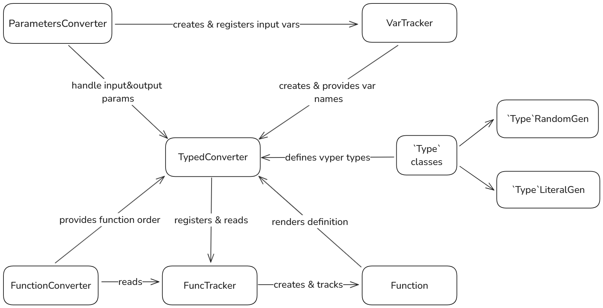

# Converters

This module provides classes and utilities to convert proto-generated payloads to `Vyper` source code. 
The converter implements the rules of the `Vyper` compiler to avoid compilation issues, ensuring that the generated code is valid and follows `Vyper's` syntax and type constraints.

## Scope
- [`typed_converters.py`](typed_converters.py): Implements `TypedConverter`, the primary converter class responsible for translating `protobuf` messages into `Vyper` source code.

- [`typed_converters_4.py`](typed_converters_4.py): Extends `TypedConverter` to handle `Vyper 0.4.0` source code.

- [`function_converter.py`](function_converter.py): Implements `FunctionConverter`, which builds call trees for functions and identifies function calls within `protobuf` statements.

- [`func_tracker.py`](func_tracker.py): Contains `Function` and `FuncTracker` classes, which tracks functions in the generated contract and their metadata.

- [`var_tracker.py`](var_tracker.py): Defines `VarTracker`, which manages variable IDs and tracks variables within different scopes for correct variable usage.

- [`parameters_converter.py`](parameters_converter.py): Defines `ParametersConverter`, which converts input and output function parameters from `protobuf` definitions into `Vyper` parameter formats.

- [`utils.py`](utils.py): Contains utility functions.

## Overview

The `protobuf` generator has no context of `Vyper` language constraints. Hence, appropriate mechanisms were implemented to generate valid source code.
Converter utilizes `function_converter` to resolve all circular calls and then step-by-step parses the message and generates the function itself.

