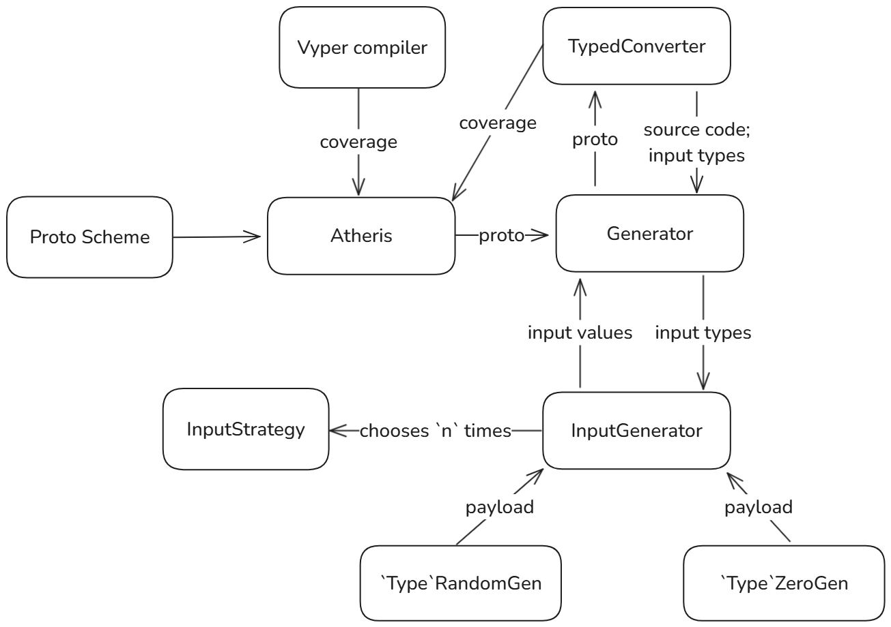

# Generators

This `Generators` module is responsible for creating and managing the generation of test inputs for fuzzing the `Vyper` compiler. Module employs an `atheris` fuzzing library to create and mutate compiler inputs.

## Scope

- [`input_generation.py`](input_generation.py): Contains the `InputGenerator` class and two strategies, which provide mechanisms to create inputs for the generated source codes (random or zero values) tailored for `Vyper` data types.

- [`run_api.py`](run_api.py): Defines the `GeneratorBase` class, setting up the core environment for fuzzing. It handles configuration, logging, and database interactions, and serves as the base for more specific generators.

- [`run_adder.py`](run_adder.py): Implements a generator focused on using a single `TypedConverter` converter to compile `Vyper 0.3.10` code.

- [`run_nagini.py`](run_nagini.py): Implements a generator focused on using a single `NaginiConverter` converter to compile `Vyper 0.4.0` code.

- [`run_diff.py`](run_diff.py): Defines a generator for cross-version differential fuzzing. It uses two different converters to generate equivalent source codes.

## Overview

The generator imports converters to generate source code based on the `protobuf` message provided by the `atheris` engine.

The `run_api.py` defines the main logic for the generator service:

- conversion of `protobuf` to `Vyper` source code
- generation of input values for the generated functions
- communication with runners via `RabbitMQ`
- saving results in the database
- information logging

The implementation must override the `compile_source` function to correctly instrument the `Vyper` compiler and converter.

