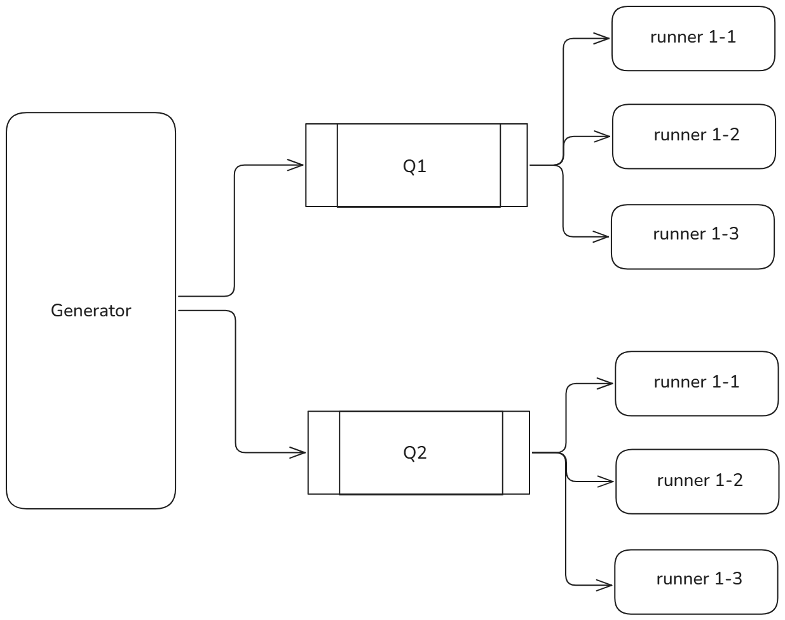

# Runners

The `runners` module is responsible for executing generated test cases. It compiles and executes all functions in the generated source code. The `titanoboa` interpreter allows runners to obtain data such as storage, memory, and gas.

## Scope

- [`runner_api.py`](runner_api.py): Defines the `RunnerBase` class, which sets up the core functionality for handling execution of source code.

- [`runner_opt.py`](runner_opt.py): Implements a runner for testing different compiler optimization settings for `Vyper 0.3.10`.

- [`runner_ir.py`](runner_ir.py): Implements a runner for testing experimental codegen in the `Vyper 0.4.0`.

- [`runner_diff.py`](runner_diff.py): Implements a runner for differential cross-version testing.

## Overview

Runners asynchronously take source codes from the generator. The amount of runners is defined via configuration file. Each runner must be running in an environment with:
- a `SERVICE_NAME` variable matching one of the names from the configuration.
- dependencies corresponding to the testing compiler

The `runner_api.py` defines the main logic for the runner service

- source code execution
- saving results 
- communication with the generator to receive source code 
- information logging

